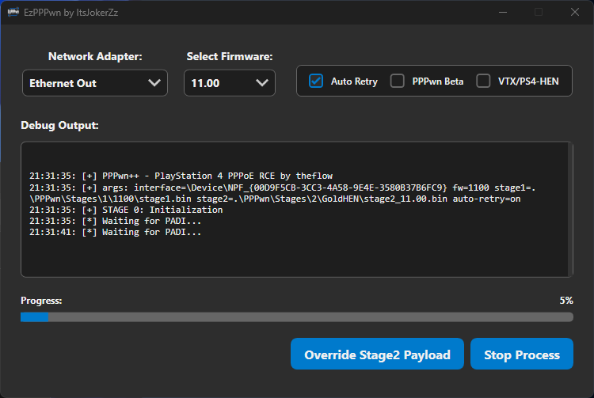

# EzPPPwn

**EzPPPwn** is a modern WPF frontend for the PPPwn (CPP) exploit targeting the firmwares listed below.  



## ✨ Features
- 🖤 **Dark Mode UI**  
- 📂 **Custom Stage2 Payload Support**  
- 🧩 **GoldHEN, VTX/PS4-HEN Integration**  
- ⚙️ **CPP Beta Compatibility Toggle**  
- 🔁 **Auto Retry Option**  
- 🧲 **System Tray Integration**  

## 📦 Supported Firmware Versions
- 7.00 / 7.01 / 7.02 /7.50 / 7.51 / 7.55  
- 8.00 / 8.01 / 8.03 / 8.50 / 8.52  
- 9.00 / 9.03 / 9.04 /9.50 / 9.51 / 9.60  
- 10.00 / 10.01 / 10.50 / 10.70 / 10.71  
- 11.00

## 🕹️ PS4 Setup Instructions

Follow these steps to prepare your PS4 for exploitation via PPPwn:

1. Place your payload(s) on the root of a USB drive:
   - `goldhen.bin`
   - `payload.bin` (VTX / PS4-HEN)
   - Or any compatible payload
2. On your PS4, go to **Settings** → **Network**
3. Select **Set Up Internet Connection** → **Use a LAN Cable**
4. Choose **Custom** setup
5. For **IP Address Settings**, select **PPPoE**
6. Enter **any value** for:
   - **PPPoE User ID**
   - **PPPoE Password**
7. Set the following:
   - **DNS Settings** → **Automatic**
   - **MTU Settings** → **Automatic**
   - **Proxy Server** → **Do Not Use**
8. Click **Test Internet Connection**

This will trigger the PS4 to attempt a PPPoE connection to your PC running EzPPPwn.

> [!TIP] 
> 💡 If the exploit fails or the PS4 kernel panics, you don't need to redo the entire setup,  
> simply restart the exploit on your PC & click **Test Internet Connection** again on the PS4.

> [!WARNING]  
> 🔁 **Stuck?** If the exploit script freezes or hangs on the PC, stop it and<br>
> then click **Test Internet Connection** again on the PS4, and start again.

If successful, the PS4 will display:
```
[+] PPPwn - PlayStation 4 PPPoE RCE by theflow
[+] args: interface=enp0s3 fw=1100 stage1=stage1/stage1.bin stage2=stage2/stage2.bin

[+] STAGE 0: Initialization
[*] Waiting for PADI...
[+] pppoe_softc: 0xffffabd634beba00
[+] Target MAC: xx:xx:xx:xx:xx:xx
[+] Source MAC: 07:ba:be:34:d6:ab
[+] AC cookie length: 0x4e0
[*] Sending PADO...
[*] Waiting for PADR...
[*] Sending PADS...
[*] Waiting for LCP configure request...
[*] Sending LCP configure ACK...
[*] Sending LCP configure request...
[*] Waiting for LCP configure ACK...
[*] Waiting for IPCP configure request...
[*] Sending IPCP configure NAK...
[*] Waiting for IPCP configure request...
[*] Sending IPCP configure ACK...
[*] Sending IPCP configure request...
[*] Waiting for IPCP configure ACK...
[*] Waiting for interface to be ready...
[+] Target IPv6: fe80::2d9:d1ff:febc:83e4
[+] Heap grooming...done

[+] STAGE 1: Memory corruption
[+] Pinning to CPU 0...done
[*] Sending malicious LCP configure request...
[*] Waiting for LCP configure request...
[*] Sending LCP configure ACK...
[*] Sending LCP configure request...
[*] Waiting for LCP configure ACK...
[*] Waiting for IPCP configure request...
[*] Sending IPCP configure NAK...
[*] Waiting for IPCP configure request...
[*] Sending IPCP configure ACK...
[*] Sending IPCP configure request...
[*] Waiting for IPCP configure ACK...
[+] Scanning for corrupted object...found fe80::0fdf:4141:4141:4141

[+] STAGE 2: KASLR defeat
[*] Defeating KASLR...
[+] pppoe_softc_list: 0xffffffff884de578
[+] kaslr_offset: 0x3ffc000

[+] STAGE 3: Remote code execution
[*] Sending LCP terminate request...
[*] Waiting for PADI...
[+] pppoe_softc: 0xffffabd634beba00
[+] Target MAC: xx:xx:xx:xx:xx:xx
[+] Source MAC: 97:df:ea:86:ff:ff
[+] AC cookie length: 0x511
[*] Sending PADO...
[*] Waiting for PADR...
[*] Sending PADS...
[*] Triggering code execution...
[*] Waiting for stage1 to resume...
[*] Sending PADT...
[*] Waiting for PADI...
[+] pppoe_softc: 0xffffabd634be9200
[+] Target MAC: xx:xx:xx:xx:xx:xx
[+] AC cookie length: 0x0
[*] Sending PADO...
[*] Waiting for PADR...
[*] Sending PADS...
[*] Waiting for LCP configure request...
[*] Sending LCP configure ACK...
[*] Sending LCP configure request...
[*] Waiting for LCP configure ACK...
[*] Waiting for IPCP configure request...
[*] Sending IPCP configure NAK...
[*] Waiting for IPCP configure request...
[*] Sending IPCP configure ACK...
[*] Sending IPCP configure request...
[*] Waiting for IPCP configure ACK...

[+] STAGE 4: Arbitrary payload execution
[*] Sending stage2 payload...
[+] Done!
```

## 🙏 Credits

- [**Andy Nguyen**](https://github.com/theofficialflow) – Discoverer of the original PPPwn vulnerability and initial implementation  
- [**Echo Stretch**](https://github.com/echostretch) – Developer of VTX-HEN and contributor to stage2 support for PS4-HEN  
- [**xfangfang**](https://github.com/xfangfang) – Developer of the PPPwn C++ implementation used in this project  
- [**SiSTRo**](https://github.com/sistr0) – Developer of GoldHEN, contributor to the VTX-HEN project, and developer the GoldHEN stage2.  
- [**Scene-Collective**](https://github.com/Scene-Collective) – Developers of PS4-HEN and other scene-related payloads and tools  
- [**PokersKun**](https://github.com/PokersKun) – Looked into their source for a reference. (same as PPPwn Lite)

… and to everyone else I may have missed, thank you all! ❤️
